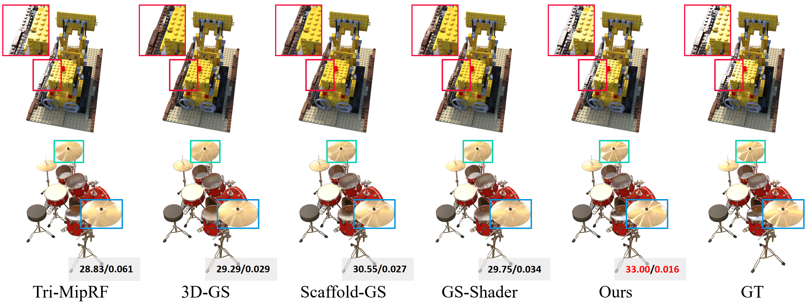

# Spec-Gaussian: Anisotropic View-Dependent Appearance for 3D Gaussian Splatting


## Dataset

In our paper, we use:

- synthetic dataset from [NeRF](https://drive.google.com/drive/folders/128yBriW1IG_3NJ5Rp7APSTZsJqdJdfc1), [NSVF](https://dl.fbaipublicfiles.com/nsvf/dataset/Synthetic_NSVF.zip), and our [Anisotropic Synthetic Dataset]()
- real-world dataset from [Mip-NeRF 360](https://jonbarron.info/mipnerf360/) and [tandt_db](https://repo-sam.inria.fr/fungraph/3d-gaussian-splatting/datasets/input/tandt_db.zip).

And the data structure should be organized as follows:

```shell
data/
├── NeRF
│   ├── Chair/
│   ├── Drums/
│   ├── ...
├── NSVF
│   ├── Bike/
│   ├── Lifestyle/
│   ├── ...
├── Spec-GS
│   ├── ashtray/
│   ├── dishes/
│   ├── ...
├── Mip-360
│   ├── bicycle/
│   ├── bonsai/
│   ├── ...
├── tandt_db
│   ├── db/
│   │   ├── drjohnson/
│   │   ├── playroom/
│   ├── tandt/
│   │   ├── train/
│   │   ├── truck/
```


## Run

### Environment

```shell
git clone https://github.com/ingra14m/Spec-Gaussian --recursive
cd Spec-Gaussian

conda create -n spec-gaussian-env python=3.7
conda activate spec-gaussian-env

# install pytorch
pip install torch==1.13.1+cu116 torchvision==0.14.1+cu116 --extra-index-url https://download.pytorch.org/whl/cu116
pip install torch-scatter -f https://data.pyg.org/whl/torch-1.13.0+cu116.html

# install dependencies
pip install -r requirements.txt
```


## Pipeline


## Results

### Synthetic Scenes




### Real-world Scenes


## BibTex

```shell

```

And thanks to the authors of [3D Gaussians](https://repo-sam.inria.fr/fungraph/3d-gaussian-splatting/) and [Scaffold-GS](https://github.com/city-super/Scaffold-GS) for their excellent code, please consider citing these repositories.
