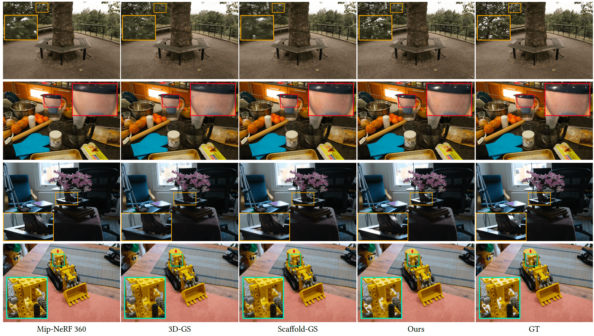

# Spec-Gaussian: Anisotropic View-Dependent Appearance for 3D Gaussian Splatting

## [Project page](https://ingra14m.github.io/Deformable-Gaussians/) | [Paper](https://arxiv.org/abs/2309.13101)


## Dataset

In our paper, we use:

- synthetic dataset from [NeRF](https://drive.google.com/drive/folders/128yBriW1IG_3NJ5Rp7APSTZsJqdJdfc1), [NSVF](https://dl.fbaipublicfiles.com/nsvf/dataset/Synthetic_NSVF.zip), and our [Anisotropic Synthetic Dataset]()
- real-world dataset from [Mip-NeRF 360](https://jonbarron.info/mipnerf360/) and [tandt_db](https://repo-sam.inria.fr/fungraph/3d-gaussian-splatting/datasets/input/tandt_db.zip).

And the data structure should be organized as follows:

```shell
data/
├── NeRF
│   ├── Chair/
│   ├── Drums/
│   ├── ...
├── NSVF
│   ├── Bike/
│   ├── Lifestyle/
│   ├── ...
├── Spec-GS
│   ├── ashtray/
│   ├── dishes/
│   ├── ...
├── Mip-360
│   ├── bicycle/
│   ├── bonsai/
│   ├── ...
├── tandt_db
│   ├── db/
│   │   ├── drjohnson/
│   │   ├── playroom/
│   ├── tandt/
│   │   ├── train/
│   │   ├── truck/
```


## Pipeline


## Run

### Environment

```shell
git clone https://github.com/ingra14m/Spec-Gaussian --recursive
cd Spec-Gaussian

conda create -n spec-gaussian-env python=3.7
conda activate spec-gaussian-env

# install pytorch
pip install torch==1.13.1+cu116 torchvision==0.14.1+cu116 --extra-index-url https://download.pytorch.org/whl/cu116
pip install torch-scatter -f https://data.pyg.org/whl/torch-1.13.0+cu116.html

# install dependencies
pip install -r requirements.txt
```


### Train

We have provided scripts [`run_anchor.sh`](https://github.com/ingra14m/Spec-Gaussian/blob/main/run_anchor.sh) and [`run_wo_anchor.sh`](https://github.com/ingra14m/Spec-Gaussian/blob/main/run_wo_anchor.sh) that were used to generate the table in the paper. 

In general, using the version without anchor Gaussian can achieve better rendering effects for synthesized bounded scenes. For real-world unbounded scenes, using the version with anchor Gaussian can achieve better results. For researchers who want to explore the use of with anchor Gaussian in bounded scenes and without anchor Gaussian in unbounded scenes, we have provided the following general training command.

**Train without anchor**

```shell
python train.py -s your/path/to/the/dataset -m your/path/to/save --eval

## For synthetic bounded scenes
python train.py -s data/nerf_synthetic/drums -m outputs/nerf/drums --eval

## For real-world unbounded scenes
python train.py -s data/mipnerf-360/bonsai -m outputs/mip360/bonsai --eval --use_filter
```


**Train with anchor**

```shell
python train_anchor.py -s your/path/to/the/dataset -m your/path/to/save --eval

## For synthetic bounded scenes
python train_anchor.py -s data/nerf_synthetic/drums -m outputs/nerf/drums --eval --voxel_size 0.001 --update_init_factor 4 --iterations 30_000

## For mip360 scenes
python train_anchor.py -s data/mipnerf-360/bonsai -m outputs/mip360/bonsai --eval --voxel_size 0.001 --update_init_factor 16 --iterations 30_000

## For tandt scenes
python train_anchor.py -s data/tandt_db/tandt/train -m outputs/tandt/train --eval --voxel_size 0.01 --update_init_factor 16 --iterations 30_000

## For deep blending scenes
python train_anchor.py -s data/tandt_db/db/drjohnson -m outputs/db/drjohnson --eval --voxel_size 0.005 --update_init_factor 16 --iterations 30_000 --use_c2f
```


## Results

### Synthetic Scenes


### Real-world Scenes



## BibTex

```shell

```

And thanks to the authors of [3D Gaussians](https://repo-sam.inria.fr/fungraph/3d-gaussian-splatting/) and [Scaffold-GS](https://github.com/city-super/Scaffold-GS) for their excellent code, please consider citing these repositories.
